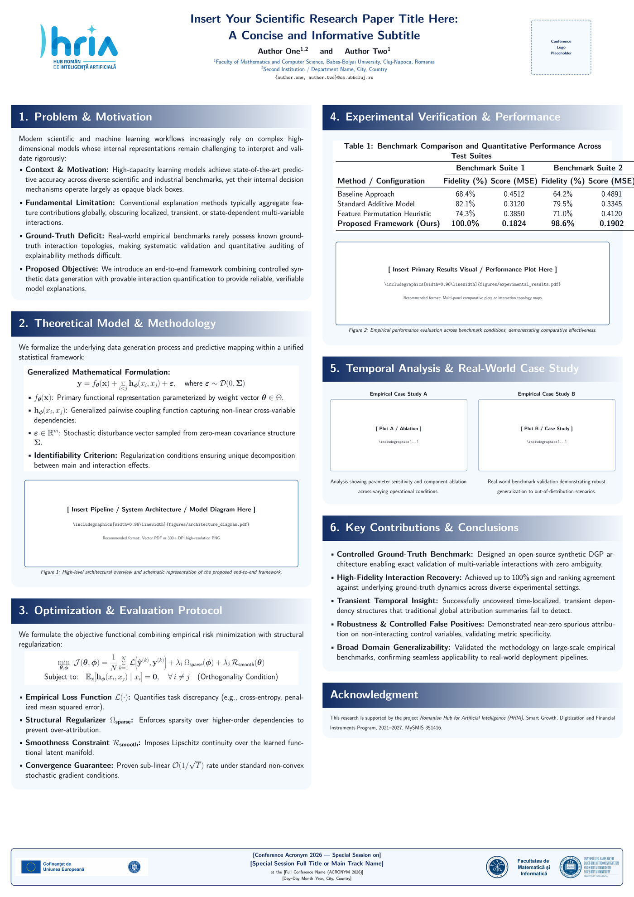

# Academic Conference Poster Template (A0 Portrait)

An elegant, modern, and highly legible academic conference poster template in **A0 portrait format** ($841 \times 1189\text{ mm}$), built with LaTeX and [`tikzposter`](https://ctan.org/pkg/tikzposter).

Created for members of the **Romanian Hub for Artificial Intelligence (HRIA)** and the **Faculty of Mathematics and Computer Science at Babeș-Bolyai University (UBB)**, but fully customizable for any academic or scientific conference.

---

## Preview

<p align="center">
  
</p>

---

## Key Features

- **Standard A0 Portrait Dimensions:** Configured with `\documentclass[25pt, a0paper, portrait]{tikzposter}` for optimal conference readability at $\ge 1.5$ meters.
- **Two-Column Balanced Layout:** 7 structured research blocks designed for seamless visual flow:
  1. **Problem & Motivation:** Context, limitations, research questions, and objectives.
  2. **Theoretical Model & Methodology:** Mathematical formulations and system architecture diagram placeholder.
  3. **Optimization & Evaluation Protocol:** Objective functions, loss formulations, and convergence criteria.
  4. **Experimental Verification & Performance:** Multi-suite benchmark table and primary results visual placeholder.
  5. **Temporal Analysis & Real-World Case Study:** Side-by-side empirical case study / ablation subfigures.
  6. **Key Contributions & Conclusions:** Structured takeaways and future research directions.
  7. **Acknowledgment:** Dedicated grant and institutional funding card.
- **Institutional Header & Footer Banners:**
  - **Header:** HRIA project logo (left), bold custom title, author names, affiliations, email contacts, and conference logo placeholder (right).
  - **Footer:** EU & Romanian Government co-financing banner (left), large clear conference metadata (center), and UBB / Faculty banner (right).
- **Accessible & High-Contrast Styling:** Curated dark blue (`#102C62`), accent blue (`#20589B`), and clean white card containers over subtle background tints.
- **Self-Contained & Generalized:** Includes drop-in placeholders for equations, tables, and diagrams.

---

## File Structure

```text
.
├── poster.tex            # Main LaTeX poster source code
├── poster.pdf            # Pre-compiled A0 poster document
├── poster_preview.png    # High-resolution raster preview
├── hria.png              # Romanian Hub for Artificial Intelligence logo
├── ue-gr.png             # EU & Romanian Government funding banner
├── ubb-uni.png           # Babeș-Bolyai University banner
├── .gitignore            # Standard LaTeX ignore rules
└── README.md             # Documentation and usage guide
```

---

## Compilation

### Prerequisites
Make sure you have a standard LaTeX distribution installed (TeX Live, MacTeX, or MiKTeX) with `tikzposter`.

### Build with `pdflatex`
```bash
pdflatex poster.tex
```

### Build with `latexmk` (Recommended)
```bash
latexmk -pdf poster.tex
```

---

## Customization Guide

All primary metadata can be customized at the top of [`poster.tex`](poster.tex):

### 1. Title, Authors, and Contact Information
```latex
\newcommand{\PosterTitle}{Insert Your Research Paper Title Here:\\[0.18em]A Informative Subtitle}
\newcommand{\PosterAuthors}{Author One\textsuperscript{1,2} \quad and \quad Author Two\textsuperscript{1}}
\newcommand{\PosterAffiliations}{\textsuperscript{1}Faculty of Mathematics and Computer Science, Babeș-Bolyai University, Cluj-Napoca, Romania\\
\textsuperscript{2}Second Institution / Department Name, City, Country}
\newcommand{\PosterEmails}{\texttt{\{author.one, author.two\}@cs.ubbcluj.ro}}
```

### 2. Conference Footer Metadata
```latex
\newcommand{\ConferenceSession}{[Conference Acronym 2026 --- Special Session on]}
\newcommand{\ConferenceName}{[Special Session Full Title or Main Track Name]}
\newcommand{\ConferenceDetails}{at the [Full Conference Name (ACRONYM 2026)]\\[0.15em] [Day--Day Month Year, City, Country]}
```

### 3. Inserting Your Own Figures & Logos
- **Conference Logo:** In the header, replace the TikZ placeholder with:
  ```latex
  \includegraphics[width=\linewidth,keepaspectratio]{my_conference_logo.png}
  ```
- **Diagrams & Results:** Replace the TikZ placeholders in Blocks 2, 4, and 5 with:
  ```latex
  \includegraphics[width=0.96\linewidth]{my_diagram.pdf}
  ```

---

## Acknowledgment & Grant Funding

This template incorporates the official acknowledgment format for projects supported by the **Romanian Hub for Artificial Intelligence (HRIA)**:
> *Supported by Romanian Hub for Artificial Intelligence (HRIA), Smart Growth, Digitization and Financial Instruments Program, 2021–2027, MySMIS 351416.*
